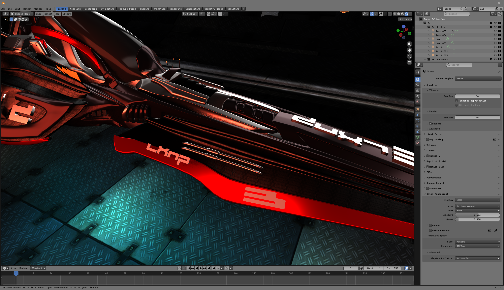
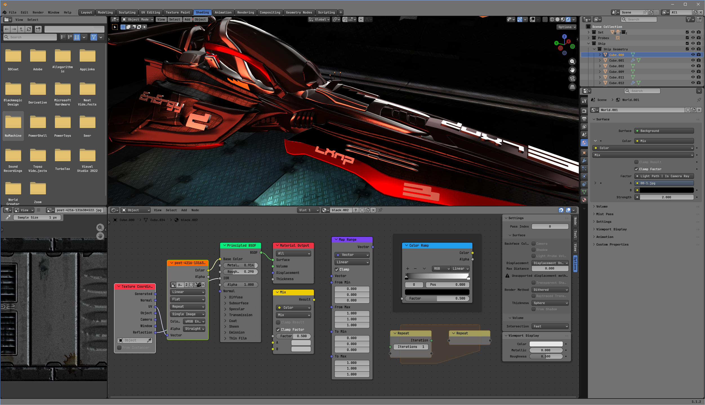
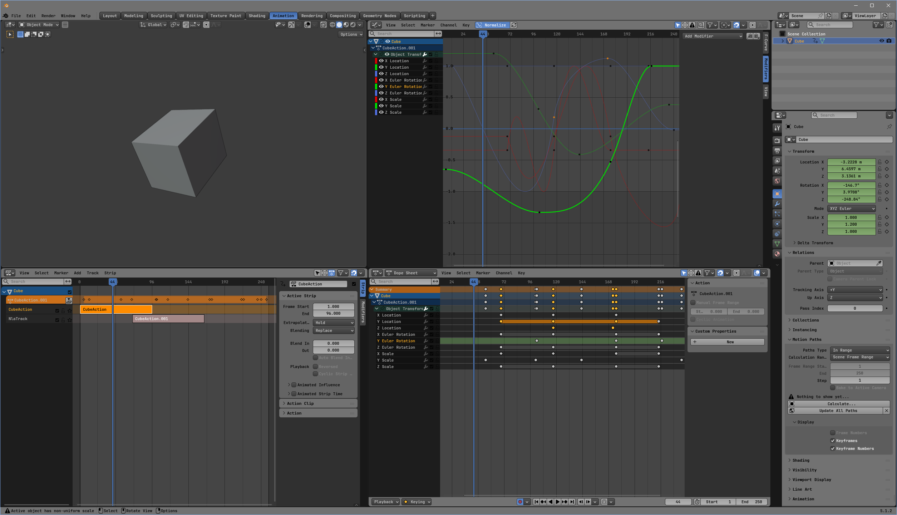
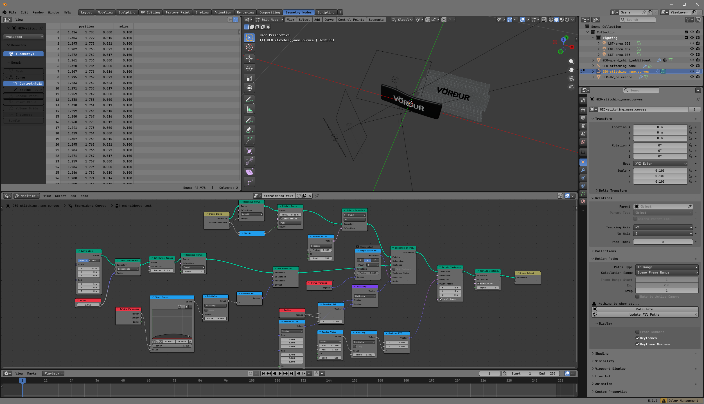
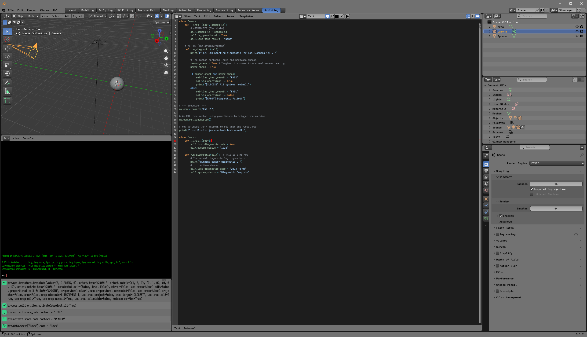

# BlendGrey
A sophisticated family of color-neutral themes inspired by the iconic Blender 2.7 aesthetic. The theme utilizes a mid-grey foundation with deep slate accents and muted blue highlights, capturing the classic 'pro-tool' feel. Reimagined for modern high-DPI workflows, it retains the signature matte surfaces and soft workspace transitions while introducing an updated UI hierarchy and a pastel-toned syntax palette—optimized for clarity, depth, and long-duration professional use.

## Contents 

  
  
  

## Themes 

  
🧊 Blender 5+

  <h4 style="margin-top: 0px; font-weight:">A premium, low-chroma theme family designed to provide a distraction-free, professional workspace inspired by the classic Blender 2.7 aesthetic</h4>
  <!-- 01: Visuals -->
  

    
    
    
    
    
  

   <!-- 02: Instructions -->
  

    <h4 style="margin-top: 0; font-weight: bold">Local Installation</h4>
    <!-- Step 1 to 3 in the ordered list -->
    <ol>
      <li style="margin-bottom: .5em;">Open the <a href="#"><b>latest releases page.</b></a></li>
      <li style="margin-bottom: .5em;"><b>Download</b> the BlendGrey zip file.</li>
      <li style="margin-bottom: .5em;">Extract the <code style="color: #ccc; background-color: #3a3a3a; padding: 2px 4px;">BlendGrey.xml</code> file into the correct <code style="color: #ccc; background-color: #3a3a3a; padding: 2px 4px;">interface_theme</code> directory for your system:</li>
    </ol>
    <!-- Warning div -->
    

      <b style="color: #ed3445">NOTE:</b> If the <code style="color: #ccc;">scripts</code>, <code style="color: #ccc;">presets</code>, or <code style="color: #ccc;">interface_theme</code> directories do not yet exist inside your version folder, create them manually.
      <ul style="margin-top: 8px; padding-left: 20px;">
        <li><b>Windows:</b> <code style="color: #ccc;">C:\Users\<YourUsername>\AppData\Roaming\Blender Foundation\Blender\5.x\scripts\presets\interface_theme\</code></li>
        <li><b>macOS:</b> <code style="color: #ccc;">/Users/<YourUsername>/Library/Application Support/Blender/5.x/scripts/presets/interface_theme/</code></li>
        <li><b>Linux:</b> <code style="color: #ccc;">~/.config/blender/5.x/scripts/presets/interface_theme/</code></li>
      </ul>
    

    <!-- Step 4 to 6 in the ordered list -->
    <ol start="4" style="margin-top: 10px;">
      <li style="margin-bottom: .5em;"><b>Launch Blender</b> and navigate to the top menu bar: Select <code style="color: #ccc; background-color: #3a3a3a; padding: 2px 4px;">Edit ➔  Preferences</code>.</li>
      <li style="margin-bottom: .5em;">Select the <code style="color: #ccc; background-color: #3a3a3a; padding: 2px 4px;">Themes</code> tab on the left side of the window.</li>
      <li style="margin-bottom: .5em;">Select the <code style="color: #ccc; background-color: #3a3a3a; padding: 2px 4px;">Presets</code> dropdown menu at the very top of the page. Your newly copied <b>BlendGrey</b> layout will be sitting right there in the list. Select it to instantly skin the UI.</li>
    </ol>
     <!-- Typography note div -->
    

      BlendGrey relies heavily on <b>open-source NerdFonts</b> to keep typography clean and legible on high-resolution displays. 
    

    <!-- Step 7 to  in the ordered list -->
    <ol start="7" style="margin-top: 10px;">
      <li style="margin-bottom: .5em;">Download and install <b>JetBrains Mono</b> and <b>Iosevka NFM</b> from <a href="https://www.nerdfonts.com/font-downloads"><b>NerdFonts</b></a></li>
      <li style="margin-bottom: .5em;">Select <code style="color: #ccc; background-color: #3a3a3a; padding: 2px 4px;">Edit ➔  Preferences</code>, then <code style="color: #ccc; background-color: #3a3a3a; padding: 2px 4px;">Interface</code>.</li>
      <li style="margin-bottom: .5em;">Expand the <code style="color: #ccc; background-color: #3a3a3a; padding: 2px 4px;">Text Rendering</code> accordian arrow.
      <li style="margin-bottom: .5em;">Set your fonts as Interface Font: <code style="color: #ccc; background-color: #3a3a3a; padding: 2px 4px;">JetBrainsMonoNL NFP Medium</code>, Monospace Font: <code style="color: #ccc; background-color: #3a3a3a; padding: 2px 4px;">Iosevka NFM</code>.</li>
      <li>That's it! Your UI should now look just like the screenshots.</li>
    </ol>
  

  
💻 VSCode

  <h4 style="margin-top: 0px; font-weight:">Complete workbench color theme and high-visibility text tokens.</h4>
  <!-- 01: Visuals -->
  

    
  

  

    <b>Installation instructions coming soon.</b>
  

## Key Features
### Optimized neutral Viewport Workflow 
  * **Unobtrusive UI:** By utilizing desaturated mid-greys and slate blues, the interface recedes into the background, allowing the vibrant colors of your 3D models, textures, and shaders to remain the primary focus without competition from the UI.
  * **Depth Perception:** Subtle use of luminance shifts between panels creates a clear sense of spatial hierarchy, making it easy to distinguish between different editor types (Node Editor, Outliner, Properties) at a glance.

### Reduced Eye Strain & Visual Comfort
* **Low-Chroma Environment:** By stripping away high-saturation "neon" colors common in many dark themes, the theme minimizes optical fatigue during extended sessions.
* **Soft Contrast Ratio:** The palette avoids harsh pure-black (#000000) and blinding white levels, opting instead for a balanced grey-scale that maintains legibility while reducing light emission/glare.

### High-Legibility Node & Code Systems
* **Pastel Syntax Palette:** Uses a carefully curated palette of pastel tones for Python syntax and Blender Shader nodes. These colors are distinct enough to be easily identified but soft enough to prevent "color bleeding" or visual clutter in complex node trees.
* **Enhanced Node Readability:** The interface provides high-contrast text against muted backgrounds, ensuring that socket types, values, and labels remain sharp and readable even in dense, multi-layered node setups.

## Support
There might be a buried menu somewhere that is tough to read or an interactive button color that feels slightly off. If you run into any visual bugs or have ideas for layout tweaks, please let me know! This theme is actively maintained, and you can report issues or submit layout ideas as an [issue ticket on the project's GitHub](https://github.com/iamren-dot-art/BlendGrey/issues).
## Credits & Acknowledgments
- Intitially forked from, and inspired by, the legacy *Grayscale* theme for Blender 4.2 LTS by [AlexMcKonst](https://github.com/AlexMcKonst/Grayscale-Color-Theme).
- Designed and maintained by **iamren**.