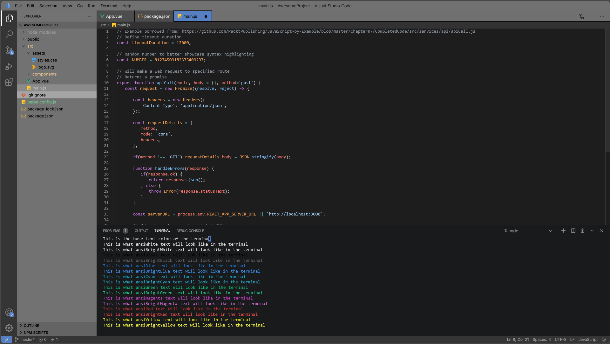

# 🎨 BlendGrey

**BlendGrey** is a cohesive mid-grey, black, and blue cross-platform theme ecosystem inspired by the classic Blender 2.7 aesthetic. Updated and refined for a modern, high-contrast workflow.

The theme aims to capture the clean layout of the classic Blender 2.7 workspace (utilizing a signature matte mid-grey on black canvas anchored by slate blue highlights) while revising the code syntax with high-contrast pastel colors optimized for modern ultrawide screens.

---

## 🚀 The Visual Tour

### 🧊 Blender 5+

### 💻 VSCode

---

## 🌐 Supported Apps (so far)

Click into any of the dedicated application directories to get specific setup files, compatibility notes, and target screenshots:

* **[🧊 Blender](./blender)** - Native UI theme overlays and script console presets.
* **[💻 VSCode](./vscode)** - Complete workbench color tweaks and high-visibility text tokens.
* **[📂 OneCommander](./onecommander)** - *(In Development)* Unified styling for your filesystem architecture.

---

## 📜 Latest Ecosystem Updates

Semantic Versioning is employed to track the evolution of each theme. 

### [1.0.0] - 2026-07-07
#### Added
- Official v1.0.0 production baseline release for full compatibility with the Blender Extensions platform.
- Refactored `blender_manifest.toml` version metadata to meet registry requirements.

#### Changed
- Promoted development tracking build state to stable release profile.
- Verified and synced internal theme XML architecture against Blender 5 theme parsing engines.

### [0.1.0] - 2026-07-06
#### Added
- **Blender (v0.1.0):** Initial refactor and layout translation for clean Blender 5 file parsing.
- **VSCode (v0.1.0):** Deployed custom pastel text tokens and button-style active file tab tracking.
- **OneCommander (v0.0.1):** Provisioned backend directory space for upcoming design alignment.

---

## 👥 Credits & Acknowledgments
- Inspired by and hard-forked from the legacy Blender 4 theme baseline created by [AlexMcKonst](https://github.com/AlexMcKonst/Grayscale-Color-Theme).
- Designed and maintained by **iamren**.