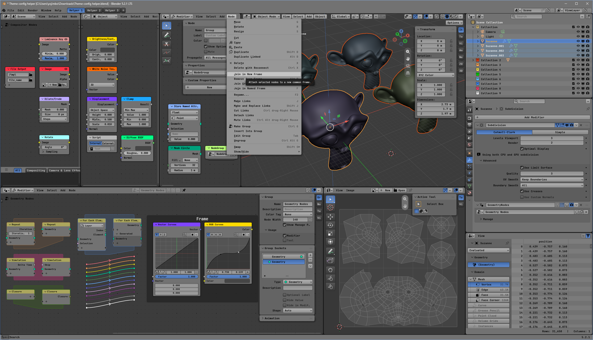
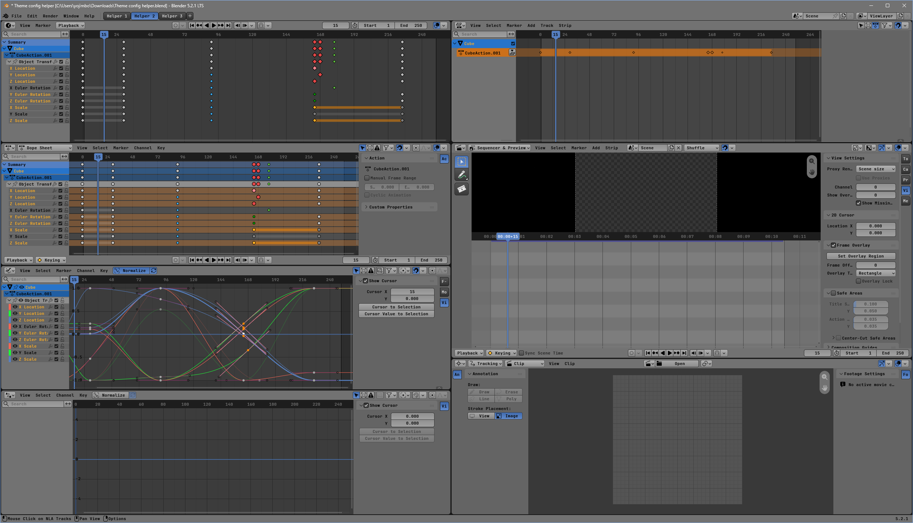
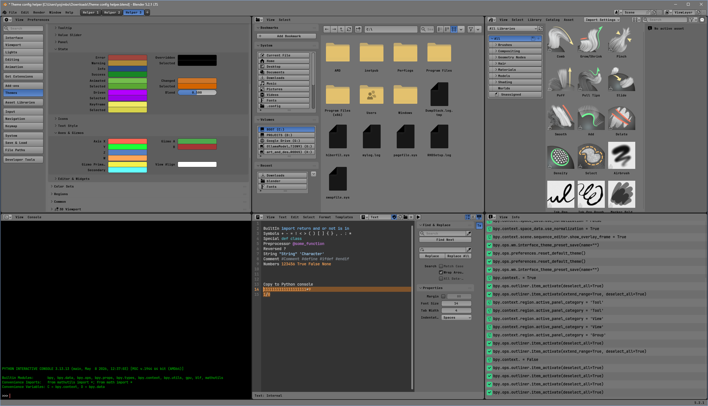

# BlendGrey

<table>
    <!--- TABLE 1 ROW 1 --->
    <tr>
      <td>
        
      </td>
      <td>
        
      </td>
    </tr>
    <tr>
      <td>
        
      </td>
    </tr>
  </table>

A color-neutral theme inspired by the iconic Blender 2.7 aesthetic. The theme utilizes a mid-grey foundation with deep slate accents and muted blue highlights. Reimagined for modern high-DPI workflows, it retains the signature matte surfaces and soft workspace transitions while introducing an updated UI and a pastel-toned syntax palette optimized for clarity and long-duration professional use.

## Contents 

   

## Install
### Blender Extensions Catalogue
**[Drag and Drop](https://extensions.blender.org/themes/blendgrey/)** into Blender from the official Extensions website.

✦ ✦ ✦

### Local Installation

1. Open the [latest releases page](#).
2. Download the blendgrey-x.x.x zip file.
3. Extract the `BlendGrey.xml` file into the correct `interface_theme` directory for your system:

> **NOTE:** If the `scripts`, `presets`, or `interface_theme` directories do not yet exist inside your version folder, create them manually.

- **Windows:** `C:\Users\<YourUsername>\AppData\Roaming\Blender Foundation\Blender\5.x\scripts\presets\interface_theme\`
- **macOS:** `/Users/<YourUsername>/Library/Application Support/Blender/5.x/scripts/presets/interface_theme/`
- **Linux:** `~/.config/blender/5.x/scripts/presets/interface_theme/`

4. Launch Blender and navigate to the top menu bar: Select `Edit ➔ Preferences`.
5. Select the `Themes` tab on the left side of the window.
6. Select the `Presets` dropdown menu at the very top of the page. Your newly copied **BlendGrey** layout will be sitting right there in the list. Select it to instantly skin the UI.

> **Typography note:** BlendGrey relies heavily on **open-source NerdFonts** to keep typography clean and legible on high-resolution displays.

7. Download and install **JetBrains Mono** and **Iosevka NFM** from [NerdFonts](https://www.nerdfonts.com/font-downloads)
8. Select `Edit ➔ Preferences`, then `Interface`.
9. Expand the `Text Rendering` accordion arrow.
10. Set your fonts as Interface Font: `JetBrainsMonoNL NFP Medium`, Monospace Font: `Iosevka NFM`.
11. That's it! Your UI should now look just like the screenshots.

## Key Features

#### Optimized Viewport Workflow 
- **Neutral UI Palette:** Uses desaturated mid-greys and slate blues to minimize UI interference, keeping the focus on 3D models, textures, and shaders.
- **Visual Hierarchy:** Leverages luminance shifts between panels to clearly distinguish between different interface groups and data sets.

#### Visual Comfort
- **Low-Chroma Environment:** Reduces optical fatigue by minimizing high-contrast colors.
- **Balanced Contrast:** Avoids pure black (#000000) and pure white, using a balanced grayscale to maintain legibility while reducing glare.

#### Node & Code Legibility
- **Pastel Syntax Palette:** Utilizes pastel tones for node sockets and code syntax to ensure distinct identification without visual clutter in complex trees.
- **High-Contrast Text:** Optimized text-to-background contrast ratios for better readability of labels, values, and socket types in dense node setups.

## Support

If you encounter visual bugs, legibility issues, or have suggestions for layout improvements, please report them via [GitHub Issues](https://github.com/iamren-dot-art/BlendGrey/issues). This theme is actively maintained, and all feedback is welcome.

## Credits & Acknowledgments
- Initially forked from, and inspired by, the legacy *Grayscale* theme for Blender 4.2 LTS by [AlexMcKonst](https://github.com/AlexMcKonst/Grayscale-Color-Theme).
- Designed and maintained by **iamren**.
